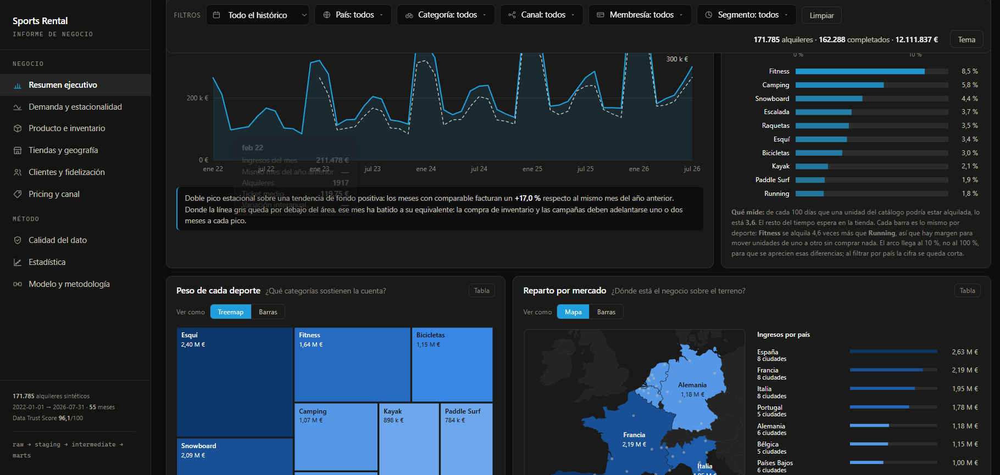
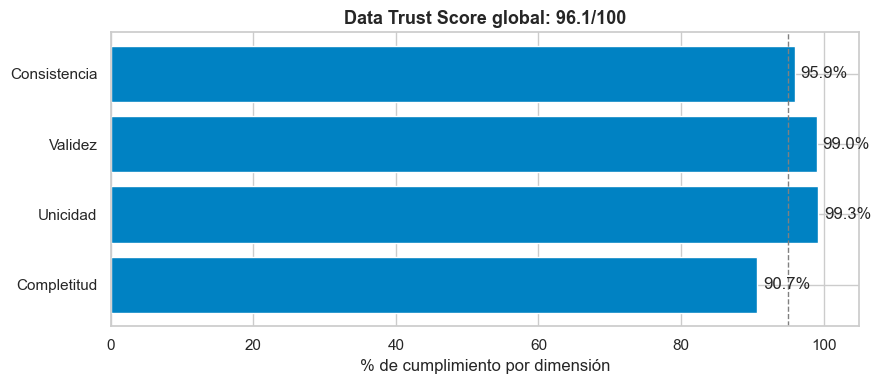
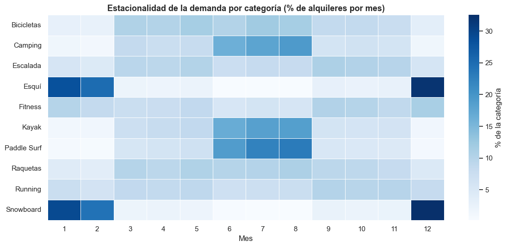
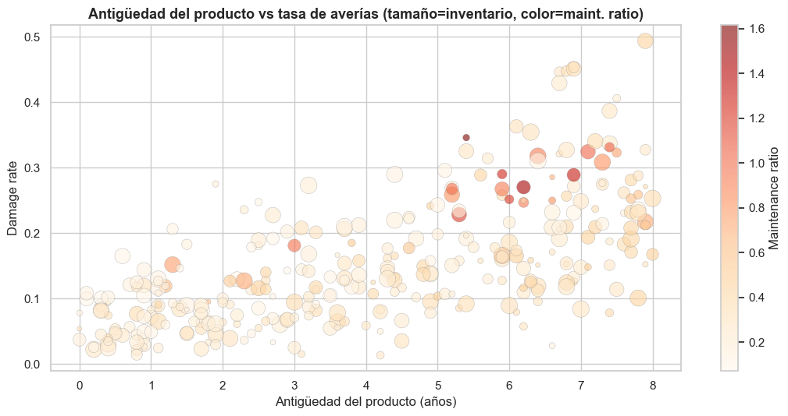
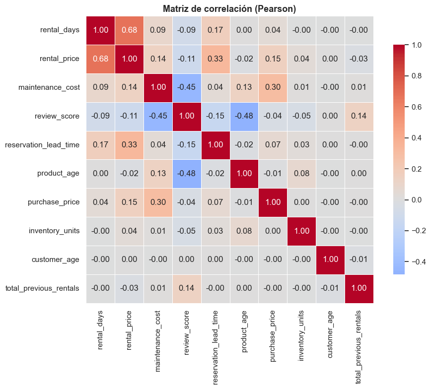
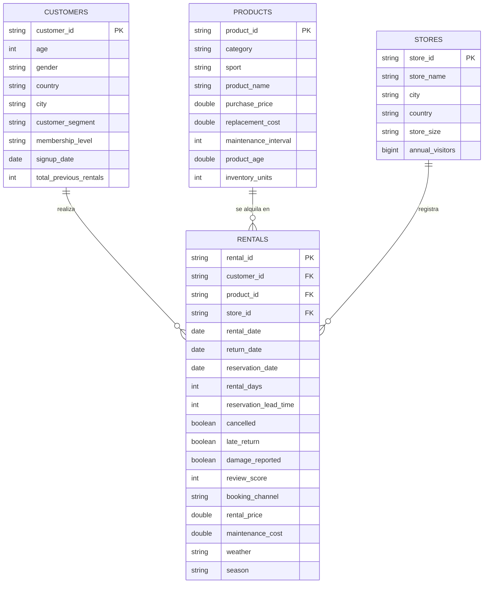

# Sports Rental — Dataset sintético y análisis de negocio

### 👉 [Abrir el informe interactivo](https://diegoprieto23.github.io/sports-rental-analytics/informe.html)

Proyecto de **Analytics Engineering** que simula y analiza el negocio de **alquiler de
material deportivo (Rental)** de un retailer europeo. Consta de tres piezas:

1. **Generador de datos** (`generate_dataset.py`) — crea un dataset sintético realista,
   con relaciones lógicas entre variables y problemas de calidad introducidos a propósito.
2. **Notebook de análisis** (`rental_analysis.ipynb`) — un análisis de negocio
   de principio a fin (calidad del dato → KPIs → SQL → EDA → estadística → recomendaciones),
   pensado para Databricks y ejecutable localmente en VSCode.
3. **Informe interactivo** (`docs/informe.html`) — el análisis convertido en una herramienta
   de exploración: seis filtros cruzados, nueve páginas y detalle hasta la referencia
   concreta, en un único fichero HTML que se abre con doble clic.

> Todos los datos son **100 % sintéticos**. No contienen información real de clientes,
> productos ni tiendas reales.

---

## Informe interactivo

<p align="center">
  
</p>

Publicado en **[GitHub Pages](https://diegoprieto23.github.io/sports-rental-analytics/)**, o
descargable para abrirlo en local: `docs/informe.html` es un cuadro de mando autocontenido,
**un solo fichero de 2,33 MB, sin servidor, sin CDN y sin dependencias**. Se abre con doble
clic, también sin conexión.

Las **171.785 filas** de la tabla de hechos limpia —55 meses, de enero de 2022 a julio de
2026— viajan dentro del HTML en columnas binarias comprimidas (≈2,1 MB en base64), no
preagregadas, de modo que **cualquier combinación de filtros se cruza de forma exacta** en
el navegador y se puede bajar hasta el producto y la tienda concretos. Los gráficos son SVG
escrito a mano; la paleta está validada para daltonismo y contraste en tema claro y oscuro.

El **mapa de negocio** alterna entre **países y ciudades** y entre **importe y número de alquileres**, y el
panel lateral da la cifra exacta que el color solo insinúa.

Seis filtros —periodo, país, categoría, canal, membresía y segmento— se aplican a la vez a
**nueve páginas**:

| Página | Qué responde |
|--------|--------------|
| **Resumen ejecutivo** | 7 KPIs con variación contra el periodo anterior, ingresos del mes frente al **mismo mes del año anterior**, **indicador radial** de ocupación de la flota con desglose por categoría, peso de cada deporte y reparto por país —ambos con conmutador **treemap/mapa ↔ barras**— y **barras divergentes** de crecimiento por categoría contra los doce meses anteriores |
| **Calidad del dato** | Data Trust Score, nulos por columna, reglas de negocio incumplidas, duplicados y outliers por la regla de Tukey |
| **Demanda y estacionalidad** | Heatmap categoría × mes, serie semanal con **detección de anomalías** (z robusto sobre MAD), día de la semana, duración, antelación de reserva y un **Sankey del ciclo de vida** del alquiler (reservado → cancelado / a tiempo / tardío / con avería) |
| **Producto e inventario** | Curva de Pareto ABC, rotación por cuartiles, ocupación frente a margen, antigüedad frente a averías, saturados e infrautilizados por capital inmovilizado |
| **Tiendas y geografía** | **Mapa coroplético** con conmutador país / ciudad e importe / alquileres, ranking de tiendas, ingreso por visitante, **treemap** país › categoría, formato de tienda y fricción operativa |
| **Clientes y fidelización** | Segmentos, distribución de review por nivel de socio, cancelación por membresía, concentración de CLRV y **cohortes de retención** |
| **Pricing y canal** | Precio/día por categoría y temporada, recorrido de pricing dinámico, **caja y bigotes** del precio, mix y fricción por canal |
| **Estadística** | Matriz de correlación, correlaciones con significación, **regresión lineal del precio**, **logística de la cancelación**, intervalos de confianza y test A/B |
| **Modelo y metodología** | Diagrama del pipeline `rental_raw → stg_* → int_* → mart_*` con los modelos dbt reales, **diagrama del modelo en estrella** con grano y cardinalidades, decisiones de modelado, supuestos del generador sintético y cómo se calcula el Data Trust Score |

Las regresiones **se recalculan sobre la selección**: no son tablas precocinadas. La lineal
se resuelve por ecuaciones normales y la logística por IRLS, ambas escritas a mano en el
propio informe.

Cada gráfico tiene su tabla equivalente detrás del botón **Tabla**, así que ningún dato
depende solo del color o del tooltip.

### Regenerar y verificar

```bash
python docs/build_report.py     # regenera docs/informe.html desde output/*.csv
python docs/verify_report.py    # contrasta sus cifras con pandas, scipy y statsmodels
node    docs/test_render.js     # renderiza las 9 páginas × 4 filtros contra un DOM simulado
```

La verificación no es cosmética. `verify_report.py` decodifica el payload igual que el
navegador y además **ejecuta el motor real del informe en Node** (`docs/test_report.js`,
que carga el mismo `report/03_core.js`), comparando contra pandas, scipy y statsmodels:
KPIs sin filtro y con filtros cruzados, correlaciones de Pearson, los 18 términos de la
regresión lineal, la logística con su log-verosimilitud, el contraste de proporciones y los
cuantiles. Todo cuadra a seis decimales.

`test_render.js` monta un DOM mínimo y renderiza las 36 combinaciones de página y filtro
para garantizar que ninguna lanza una excepción, incluida la selección sin resultados.

`docs/make_geo.py` es lo único del proyecto que necesita conexión, y solo hay que
ejecutarlo si cambia la ventana del mapa o la lista de países con negocio: su salida
(`docs/report/03b_geo.js`) está versionada, de modo que el build funciona sin red.

### Integración continua

En cada push, [GitHub Actions](.github/workflows/ci.yml) reproduce el proyecto entero y
falla si alguna de sus tres promesas deja de cumplirse:

| Se comprueba | Cómo |
|---|---|
| El generador es determinista | Dos pasadas seguidas producen ficheros con el mismo SHA-256 |
| Los CSV del repo salen de ese generador | `git diff` sobre `output/` después de regenerar |
| El notebook ejecuta limpio | `nbconvert --execute` y recuento de celdas con `output_type == "error"` |
| El informe publicado está al día | Se reconstruye y se compara con el commiteado (Pages sirve el fichero versionado, no el recién construido) |
| Las cifras siguen cuadrando | `verify_report.py` contra pandas, scipy y statsmodels |
| Las 9 páginas renderizan | `test_render.js` sobre 4 escenarios de filtro |

La reproducibilidad byte a byte solo se sostiene **dentro de las mismas versiones** de
numpy, pandas y faker, así que el CI instala con `-c constraints.txt`, que las clava a las
que generaron los datos del repositorio. Si un día hay que subirlas, la secuencia es
consciente: actualizar el pin, regenerar, revisar el diff y commitear ambas cosas.

Las cifras del informe son las mismas que las del notebook: 12.111.837,37 € de ingresos,
76,25 € de ticket medio, 5,528 % de cancelación y un Data Trust Score de 96,12.

---

## Vistazo al análisis

**Primero la confianza en el dato.** Antes de decidir nada se auditan cuatro dimensiones de
calidad y se condensan en un índice interpretable. El dato entra con un **90,7 % de
completitud** (nulos inyectados a propósito) y una **consistencia del 95,9 %** por categorías
mal escritas — problemas reales que el pipeline resuelve de forma documentada.

<p align="center">
  
</p>

**La estacionalidad es el hallazgo estructural.** Esquí y snowboard concentran más de la
mitad de su demanda en diciembre–febrero; camping, kayak y paddle surf en junio–agosto.
Traducción de negocio: ese inventario está **parado medio año**, y ahí es donde se pierde
margen que no se recupera.

<p align="center">
  
</p>

**El envejecimiento tiene coste doble.** La tasa de averías pasa del 6 % en producto nuevo al
23 % a los siete años, y el color muestra que el *maintenance ratio* sube con ella.
Existe una **edad umbral** a partir de la cual mantener la unidad deja de compensar: es la
base de una política de renovación de flota.

<p align="center">
  
</p>

**Las variables se comportan como debían.** El precio se construye por duración
(`rental_days ~ rental_price` = **0,68**) y la satisfacción cae con la antigüedad
(**−0,48**) y con el coste de mantenimiento (**−0,45**). Ninguna correlación espuria
fuerte: el dataset es coherente y las variables están listas para modelar.

<p align="center">
  
</p>

---

## Estructura del proyecto

```
sports-rental-analytics/
├── generate_dataset.py                  # Generador del dataset sintético
├── rental_analysis.ipynb                # Notebook de análisis local (VSCode / Jupyter)
├── requirements.txt                     # Dependencias del proyecto
├── constraints.txt                      # Versiones exactas que fijan la reproducibilidad
├── README.md                            # Este archivo
│
├── .github/workflows/ci.yml             # CI: dataset, notebook e informe en cada push
│
├── output/                              # Salida del generador (se crea al ejecutar)
│   ├── customers.csv                    # Dimensión de clientes
│   ├── products.csv                     # Dimensión de productos
│   ├── stores.csv                       # Dimensión de tiendas
│   ├── rentals.csv                      # Tabla de hechos de alquileres
│   └── README.md                        # Diccionario de datos + KPIs (autogenerado)
│
├── docs/                                # Raíz de GitHub Pages
│   ├── index.html                       # Portada publicada del proyecto
│   ├── informe.html                     # Informe interactivo (se abre con doble clic)
│   ├── build_report.py                  # Ensambla el informe desde los CSV y report/
│   ├── verify_report.py                 # Contrasta sus cifras con pandas y statsmodels
│   ├── test_report.js                   # Ejecuta el motor del informe en Node
│   ├── test_render.js                   # Renderiza las 9 páginas contra un DOM simulado
│   ├── make_geo.py                      # Extrae las fronteras del mapa (Natural Earth)
│   ├── report/                          # Piezas del informe (estilos, motor, geo, gráficos, páginas)
│   ├── modelo_relacional.drawio         # Diagrama editable del modelo de datos
│   └── img/                             # Capturas del análisis
│
└── databricks/                          # Industrialización en el Lakehouse
    ├── dbt/                             # 17 modelos + 46 tests (fuente de verdad)
    ├── notebooks/                       # Notebooks SQL generados desde dbt
    ├── analysis/                        # Análisis sobre las tablas Gold + queries del EDA
    ├── resources/                       # Definición de los Jobs encadenados
    └── README.md                        # Guía completa del pipeline
```

---

## Quickstart

### 1. Requisitos
- Python 3.10+ (probado en 3.13)
- Recomendado: entorno virtual (`venv` o `conda`)

### 2. Instalación de dependencias
```bash
python -m venv .venv
# Windows
.venv\Scripts\activate
# macOS / Linux
source .venv/bin/activate

python -m pip install -r requirements.txt
```

### 3. Generar el dataset
```bash
python generate_dataset.py
```
Crea la carpeta `output/` con los cuatro CSV y su diccionario de datos. El proceso es
**100 % reproducible** (semilla fija): dos ejecuciones producen ficheros idénticos.

### 4. Abrir el análisis
Abre `rental_analysis.ipynb` en **VSCode**, selecciona el kernel de Python del
entorno virtual y pulsa **Run All**. El notebook lee los CSV de `output/`.

---

## Parte 1 · Generador del dataset (`generate_dataset.py`)

Simula el negocio: cada **alquiler** pertenece a un **cliente** que alquila un
**producto** en una **tienda**. El script está organizado en funciones separadas por
entidad (`generate_stores`, `generate_products`, `generate_customers`, `generate_rentals`)
más la inyección de calidad y la exportación.

### Volumen (por defecto)
| Tabla | Filas aprox. | Rol |
|-------|-------------:|-----|
| `customers.csv` | 45.000 | Dimensión |
| `products.csv`  | ~320   | Dimensión |
| `stores.csv`    | ~70    | Dimensión |
| `rentals.csv`   | 170.000–190.000 | **Tabla de hechos** |

10 categorías (Bicicletas, Esquí, Snowboard, Paddle Surf, Kayak, Camping, Escalada,
Running, Fitness, Raquetas) y 7 países (España, Francia, Italia, Alemania, Portugal,
Bélgica, Países Bajos).

### Reglas de negocio incorporadas
El dataset **no es aleatorio**: las variables dependen unas de otras.
- **Estacionalidad:** esquí/snowboard ≈ invierno; camping/kayak/paddle ≈ verano;
  bicicletas en primavera/verano; running todo el año; fitness sube en invierno.
- **Temporalidad:** más reservas en fin de semana y festivos; picos de volumen en
  verano e invierno; crecimiento interanual.
- **Cliente:** socios Premium/Gold cancelan menos; clientes frecuentes/VIP puntúan mejor.
- **Producto:** mayor antigüedad, duración e intensidad de uso → más averías y
  mantenimiento.
- **Precio dinámico:** `rental_price` = f(categoría, duración, temporada, país, demanda),
  con descuento por nivel de socio.

### Calidad del dato (problemas deliberados)
Para practicar limpieza real: ~1 % duplicados, ~2 % de nulos por columna, fechas
inconsistentes, reviews imposibles, outliers, categorías mal escritas y texto con
mayúsculas/espacios inconsistentes — **sin invalidar** el conjunto.

> El **diccionario de datos completo** (columnas, tipos, cardinalidades y KPIs) está en
> [`output/README.md`](output/README.md), generado automáticamente por el script.

### Modelo de datos (esquema estrella)

`rentals` es la **tabla de hechos** —una fila por alquiler— y las otras tres son
**dimensiones** que describen el *quién*, el *qué* y el *dónde* de cada operación.



**Cardinalidades:** `customers 1—N rentals` · `products 1—N rentals` · `stores 1—N rentals`.
Un cliente tiene muchos alquileres, un producto se alquila muchas veces y una tienda
registra muchos alquileres.

> **Diagrama editable:** [`docs/modelo_relacional.drawio`](docs/modelo_relacional.drawio).
> Se abre en [app.diagrams.net](https://app.diagrams.net) (`File → Open from → Device`) o
> directamente en VSCode con la extensión *Draw.io Integration*.

> **Sobre los `store_id` nulos:** en torno al 2 % de los alquileres llegan sin tienda
> asignada. **No son huérfanos** —cuando el `store_id` existe siempre apunta a una tienda
> válida—, así que el pipeline los conserva con un `LEFT JOIN`: el ingreso es real aunque
> se desconozca dónde se registró. Descartarlos sesgaría los ingresos a la baja.

---

## Parte 2 · Notebook de análisis (`rental_analysis.ipynb`)

Un análisis orientado a **negocio y producto**: encuentra oportunidades de mejora y las
prioriza por impacto. Alterna **SQL** (celdas `%%sql`) y **Python** para el análisis
avanzado.

### Contenido (10 secciones)
1. **Introducción** — contexto, objetivos, hipótesis y catálogo de KPIs.
2. **Carga y validación** — lectura, comprobación de PK/FK, merge del modelo estrella.
3. **Data Quality Assessment** — missing, duplicados, tipos, valores imposibles, outliers
   (IQR), categorías inconsistentes y un **Data Trust Score** (0–100), con pipeline de
   limpieza documentado.
4. **Ingeniería de variables** — Occupancy Rate, Utilization, Revenue per Unit, Profit,
   Margin, Maintenance Ratio, Cancellation/Late/Damage Rate, Customer Lifetime Rental Value.
5. **SQL** — top tiendas, categorías, productos infrautilizados/saturados, clientes más
   activos, ingresos por país, evolución mensual y ranking de ciudades.
6. **EDA** — heatmap estacional, series temporales con media móvil, boxplot, violin,
   scatter/bubble, treemap y matriz de correlación. Cada gráfico responde una pregunta.
7. **Estadística** — correlaciones con significación, **regresión OLS** de precio,
   **regresión logística** de cancelación e **intervalos de confianza**.
8. **Insights consolidados** — conclusiones accionables.
9. **Recomendaciones** — inventario, pricing, mantenimiento, campañas, forecasting,
   segmentación (priorizadas por impacto/esfuerzo).
10. **Producción** — cómo industrializarlo: dbt, Lakehouse (medallion), Data Mart,
    Tableau, Git/CI, tests de calidad, alertas, catálogo de métricas y Data Contracts.

### Compatibilidad Databricks ↔ VSCode
Las celdas `%%sql` se ejecutan **localmente con DuckDB** (motor SQL embebido, equivalente
funcional a *Databricks SQL* sobre las mismas tablas). En Databricks se usaría `%sql`
nativo sobre las tablas del Lakehouse. Incluye una demo **opcional** de transformación con
PySpark, controlada por el flag `RUN_PYSPARK` (desactivada por defecto para no depender de
un runtime Spark local).

---

## Stack tecnológico

| Uso | Librerías |
|-----|-----------|
| Generación de datos | `pandas`, `numpy`, `faker` |
| Análisis y visualización | `pandas`, `numpy`, `matplotlib`, `seaborn`, `plotly` |
| Estadística | `scipy`, `statsmodels` |
| SQL local | `duckdb` |
| Notebook | `ipykernel` (extensión Jupyter de VSCode) |
| Opcional (escala) | `pyspark` (requiere Java; nativo en Databricks) |

Versiones fijadas en [`requirements.txt`](requirements.txt).

---

## Reproducibilidad
El generador usa un `numpy.random.Generator` con semilla fija (`SEED = 42`) propagada a
NumPy, `random` y Faker. El notebook se apoya en esos datos deterministas, por lo que los
resultados (KPIs, modelos, Data Trust Score) son estables entre ejecuciones.

---

## KPIs principales
Occupancy Rate · Utilization · Revenue per Inventory Unit · Gross Profit · Margin ·
Maintenance Ratio · Cancellation Rate · Late Return Rate · Damage Rate ·
Customer Lifetime Rental Value (CLRV). Definiciones detalladas en el notebook (sección 4)
y en [`output/README.md`](output/README.md).
